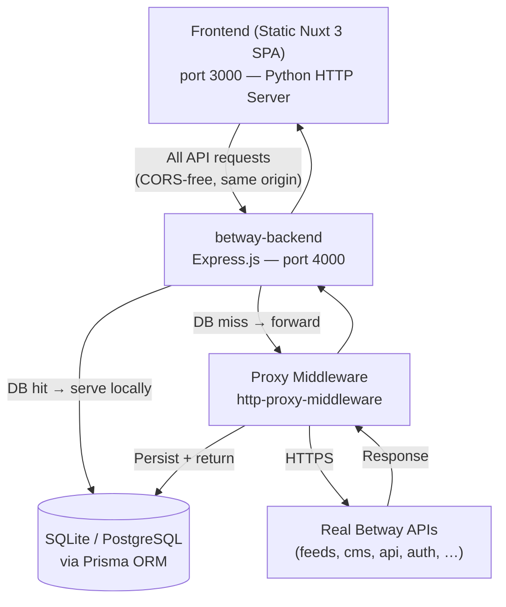
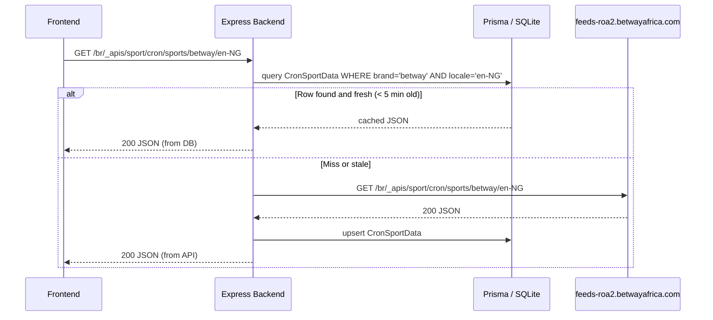
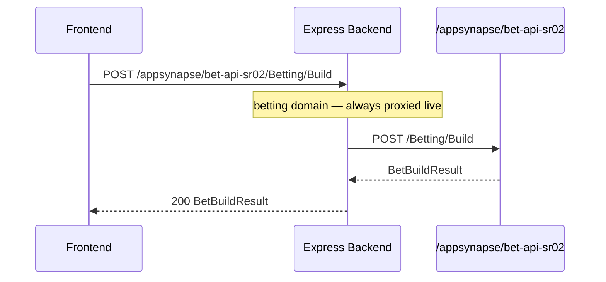
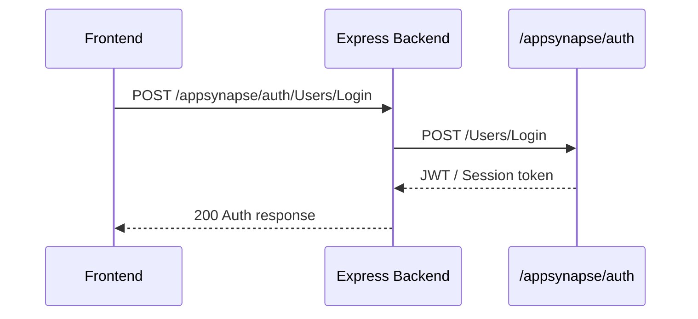

# Design Document: betway-prisma-backend

## Overview

This document describes the design of a Node.js/Express backend server that intercepts all API calls
from a static Betway Nigeria Nuxt 3 SPA. The backend stores and serves data via Prisma ORM (SQLite
for development, PostgreSQL for production) and transparently proxies to the real Betway APIs for
any request not yet cached in the local database. The only change to the frontend is a single edit
to `window.__NUXT__.config` in `index.html` that points every domain to `http://localhost:4000`.

## Architecture



## Sequence Diagrams

### Sports Feed Request (cache-first)



### Bet Build Request (always live)



### Auth Request (always proxied)



## Components and Interfaces

### Component 1: Express App & Route Registry (`src/app.ts`)

**Purpose**: Bootstrap Express, register all middleware, mount route groups.

**Interface**:
```typescript
// src/app.ts
import express from 'express'
export function createApp(): express.Application
export function startServer(port: number): void
```

**Responsibilities**:
- Apply CORS headers (`Access-Control-Allow-Origin: *`)
- Apply JSON body parser
- Mount route groups: sports, betting, content, auth, player, api, apic, casino, config, promo, signalr
- Mount catch-all proxy middleware as final fallback

---

### Component 2: Domain Router (`src/router/index.ts`)

**Purpose**: Map each `window.__NUXT__.config` domain prefix to its Express router.

**Domain → Local Path mapping** (mirrors what `index.html` will be patched to):

| Original domain | Local path prefix |
|---|---|
| `https://feeds-roa2.betwayafrica.com/br/_apis/sport` | `/br/_apis/sport` |
| `/appsynapse/bet-api-sr02` | `/appsynapse/bet-api-sr02` |
| `https://cms1.betwayafrica.com` | `/cms` |
| `/appsynapse/auth` | `/appsynapse/auth` |
| `/appsynapse/player` | `/appsynapse/player` |
| `https://api.betwayafrica.com/api` | `/api` |
| `https://apic.betwayafrica.com/api` | `/apic` |
| `https://casinoapi.betwayafrica.com/api` | `/casinoapi` |
| `https://config.betwayafrica.com` | `/config` |
| `https://signalrapi.betwayafrica.com` | `/signalr` |
| `https://promoapi.betwayafrica.com` | `/promoapi` |
| `/sportsapi/br` | `/sportsapi/br` |
| `/appsynapse/universal` | `/appsynapse/universal` |

---

### Component 3: Sports Router (`src/routes/sports.ts`)

**Purpose**: Handle all sport-feed endpoints with cache-first DB logic.

**Key routes**:
```typescript
router.get('/cron/sports/:brand/:locale', SportsCronController.getSports)
router.get('/cron/esports/:brand/:locale', SportsCronController.getEsports)
router.get('/MarketGroupings/MarketGroupNamesAndMarketsForEvent', MarketsController.getMarkets)
router.get('/FeedsMarket', MarketsController.getFavouriteMarkets)
router.get('/cron/sports-book/market-header-config/:app/:brand/:sportId', ConfigController.getMarketHeaders)
```

### Component 4: Betting Router (`src/routes/betting.ts`)

**Purpose**: Handle bet-slip building — always live-proxied, never cached.

**Key routes**:
```typescript
router.post('/Betting/Build', BettingController.buildBet)
router.post('/Betting/Place', BettingController.placeBet)
router.get('/Betting/OpenBets', BettingController.getOpenBets)
router.post('/Betting/CashOut', BettingController.cashOut)
```

---

### Component 5: Auth / Player Router (`src/routes/auth.ts`, `src/routes/player.ts`)

**Purpose**: Proxy all authentication and player-profile calls transparently.

**Key routes**:
```typescript
// auth
router.post('/Users/Login', authProxy)
router.post('/Users/Register', authProxy)
router.post('/Users/Logout', authProxy)
router.post('/Users/ForgotPassword', authProxy)
router.post('/Users/SendAccountMobileNumberVerificationOTP', authProxy)

// player
router.get('/Users/GetProfile', playerProxy)
router.put('/Users/UpdateProfile', playerProxy)
router.get('/UserAccountFavourite/GetUserAccountFavourite', playerProxy)
router.post('/UserAccountFavourite/AddUserAccountFavourite', playerProxy)
router.delete('/UserAccountFavourite/RemoveUserAccountFavourite', playerProxy)
```

---

### Component 6: Content (Kentico CMS) Router (`src/routes/content.ts`)

**Purpose**: Serve CMS content with a DB cache; fall through to real CMS on miss.

**Key routes**:
```typescript
// Kentico query param style: ?host=...&route=...&lang=...
router.get('/', ContentController.getContent)
```

---

### Component 7: Proxy Middleware (`src/middleware/proxy.ts`)

**Purpose**: Transparently forward any request that has no local handler (or explicit miss)
to the correct upstream Betway domain. Optionally persist the response to the DB.

**Interface**:
```typescript
interface ProxyConfig {
  pathPrefix: string    // e.g. '/appsynapse/auth'
  target: string        // e.g. 'https://auth.betwayafrica.com'
  stripPrefix?: string  // path to strip before forwarding
  persist?: boolean     // whether to write response body to DB cache
}
function createProxy(config: ProxyConfig): express.RequestHandler
```

### Component 8: Static File Server (`src/routes/static.ts`)

**Purpose**: Serve the frontend SPA files and CDN assets so a single `http://localhost:4000`
serves the whole app without needing the Python HTTP server.

**Responsibilities**:
- Serve `www.betway.com.ng/` at `/`
- Serve `cdn.betwayafrica.com/` at `/cdn.betwayafrica.com/`
- Serve `cms1.betwayafrica.com/` at `/cms1.betwayafrica.com/`

---

## Data Models

### Prisma Schema Overview

```prisma
// prisma/schema.prisma

datasource db {
  provider = "sqlite"          // switch to "postgresql" for production
  url      = env("DATABASE_URL")
}

generator client {
  provider = "prisma-client-js"
}
```

### Model: Sport

```prisma
model Sport {
  sportId    String   @id
  name       String
  alias      String
  sortIndex  Int      @default(0)
  isEsport   Boolean  @default(false)
  createdAt  DateTime @default(now())
  updatedAt  DateTime @updatedAt

  events     Event[]
  regions    Region[]
}
```

### Model: Region

```prisma
model Region {
  regionId    String   @id
  sportId     String
  name        String
  defaultName String
  sortIndex   Int      @default(999)
  createdAt   DateTime @default(now())
  updatedAt   DateTime @updatedAt

  sport       Sport    @relation(fields: [sportId], references: [sportId])
  leagues     League[]
}
```

### Model: League

```prisma
model League {
  leagueId    String   @id
  regionId    String
  sportId     String
  name        String
  defaultName String
  friendlyName String?
  sortIndex   Int      @default(0)
  shouldDisplay Boolean @default(true)
  createdAt   DateTime @default(now())
  updatedAt   DateTime @updatedAt

  region      Region   @relation(fields: [regionId], references: [regionId])
  events      Event[]
}
```

### Model: Event

```prisma
model Event {
  eventId           Int      @id
  sportId           String
  leagueId          String?
  name              String
  startTime         DateTime
  isLive            Boolean  @default(false)
  isTwoUpEnabled    Boolean  @default(false)
  shouldDisplay     Boolean  @default(true)
  isProducerActive  Boolean  @default(true)
  homeTeam          String?
  awayTeam          String?
  createdAt         DateTime @default(now())
  updatedAt         DateTime @updatedAt

  sport             Sport    @relation(fields: [sportId], references: [sportId])
  league            League?  @relation(fields: [leagueId], references: [leagueId])
  markets           Market[]
  scores            Score[]
}
```

### Model: Market

```prisma
model Market {
  marketId          String   @id
  eventId           Int
  name              String
  displayName       String
  subscriptionId    String?
  isSuspended       Boolean  @default(false)
  isCashOutAllowed  Boolean  @default(false)
  isSquashedMarket  Boolean  @default(false)
  shouldDisplay     Boolean  @default(true)
  originalMarketId  String?
  sortIndex         Int      @default(0)
  createdAt         DateTime @default(now())
  updatedAt         DateTime @updatedAt

  event             Event    @relation(fields: [eventId], references: [eventId])
  outcomes          Outcome[]
}
```

### Model: Outcome

```prisma
model Outcome {
  outcomeId        String   @id
  marketId         String
  eventId          Int
  displayName      String
  sbv              String?
  index            Int      @default(0)
  handicap         Float    @default(0)
  shouldDisplay    Boolean  @default(true)
  originalMarketId String?
  createdAt        DateTime @default(now())
  updatedAt        DateTime @updatedAt

  market           Market   @relation(fields: [marketId], references: [marketId])
  price            Price?
}
```

### Model: Price

```prisma
model Price {
  outcomeId            String   @id
  possibleWinnings     String   // decimal odds string e.g. "2.50"
  possibleWinningsNum  Int      @default(0)
  possibleWinningsDen  Int      @default(1)
  updatedAt            DateTime @updatedAt

  outcome              Outcome  @relation(fields: [outcomeId], references: [outcomeId])
}
```

### Model: Score

```prisma
model Score {
  scoreId    String   @id @default(cuid())
  eventId    Int      @unique
  homeScore  Int      @default(0)
  awayScore  Int      @default(0)
  period     String?
  minute     Int?
  updatedAt  DateTime @updatedAt

  event      Event    @relation(fields: [eventId], references: [eventId])
}
```

### Model: User

```prisma
model User {
  userId        String   @id @default(cuid())
  username      String   @unique
  email         String   @unique
  passwordHash  String
  firstName     String?
  lastName      String?
  mobileNumber  String?
  countryCode   String   @default("NG")
  currencyCode  String   @default("NGN")
  defaultBetSize Float   @default(100)
  isVerified    Boolean  @default(false)
  createdAt     DateTime @default(now())
  updatedAt     DateTime @updatedAt

  betSlips      BetSlip[]
  favourites    UserFavourite[]
}
```

### Model: BetSlip

```prisma
model BetSlip {
  betSlipId    String   @id @default(cuid())
  userId       String
  status       String   @default("PENDING")  // PENDING | WON | LOST | VOID | CASHOUT
  totalOdds    Float
  stake        Float
  potentialWin Float
  placedAt     DateTime @default(now())
  settledAt    DateTime?

  user         User     @relation(fields: [userId], references: [userId])
  selections   BetSelection[]
}
```

### Model: BetSelection

```prisma
model BetSelection {
  selectionId    String   @id @default(cuid())
  betSlipId      String
  eventId        Int
  marketId       String
  outcomeId      String
  isEachWay      Boolean  @default(false)
  numberOfLines  Int      @default(1)
  priceDec       Float
  priceNum       Int
  priceDen       Int
  suspended      Boolean  @default(false)

  betSlip        BetSlip  @relation(fields: [betSlipId], references: [betSlipId])
}
```

### Model: UserFavourite

```prisma
model UserFavourite {
  id            String   @id @default(cuid())
  userId        String
  favouriteType String   // "League" | "Market" | "Event"
  itemId        String
  sportId       String?
  title         String?
  region        String?
  createdAt     DateTime @default(now())

  user          User     @relation(fields: [userId], references: [userId])

  @@unique([userId, favouriteType, itemId])
}
```

### Model: CronCache (generic JSON blob cache)

```prisma
model CronCache {
  id        String   @id @default(cuid())
  cacheKey  String   @unique  // e.g. "sports:betway:en-NG"
  data      String            // JSON stringified payload
  fetchedAt DateTime @default(now())
  expiresAt DateTime
}
```

## Algorithmic Pseudocode

### Main Request Handler Algorithm

```pascal
ALGORITHM handleRequest(req, res, next)
INPUT:  req: Express.Request, res: Express.Response, next: NextFunction
OUTPUT: HTTP response sent or next() called

BEGIN
  path    ← req.path
  method  ← req.method
  
  // Step 1: Identify route type
  handler ← routeRegistry.match(method, path)
  
  IF handler IS NULL THEN
    // No registered handler → catch-all proxy
    CALL proxyMiddleware(req, res, next)
    RETURN
  END IF
  
  // Step 2: Execute handler (may use DB cache or proxy)
  CALL handler(req, res, next)
END
```

### Cache-First Sports Data Algorithm

```pascal
ALGORITHM getCronSports(req, res)
INPUT:  brand: String, locale: String  (from req.params)
OUTPUT: JSON sports data

BEGIN
  cacheKey ← CONCAT("sports:", brand, ":", locale)
  ttl      ← 300  // 5 minutes in seconds
  
  // Step 1: Check cache
  cached ← db.CronCache.findUnique(WHERE cacheKey = cacheKey)
  
  IF cached IS NOT NULL AND cached.expiresAt > NOW() THEN
    RETURN res.json(JSON.parse(cached.data))
  END IF
  
  // Step 2: Forward to upstream
  upstreamUrl ← CONCAT(SPORTS_DOMAIN, "/cron/sports/", brand, "/", locale)
  response    ← await fetch(upstreamUrl)
  
  IF response.status ≠ 200 THEN
    RETURN res.status(response.status).json({ error: "Upstream error" })
  END IF
  
  payload ← await response.json()
  
  // Step 3: Persist to cache
  db.CronCache.upsert(
    WHERE  cacheKey = cacheKey,
    UPDATE { data: JSON.stringify(payload), expiresAt: NOW() + ttl, fetchedAt: NOW() },
    CREATE { cacheKey, data: JSON.stringify(payload), expiresAt: NOW() + ttl }
  )
  
  // Step 4: Parse and persist entities (async, non-blocking)
  SPAWN persistSportEntities(payload)
  
  RETURN res.json(payload)
END
```

### Persist Sport Entities Algorithm

```pascal
ALGORITHM persistSportEntities(payload)
INPUT:  payload: CronSportsResponse
OUTPUT: side effect — DB rows upserted

BEGIN
  FOR each sport IN payload.sports DO
    db.Sport.upsert(WHERE sportId = sport.sportId, data = sport)
    
    FOR each region IN sport.regions DO
      db.Region.upsert(WHERE regionId = region.regionId, data = region)
      
      FOR each league IN region.leagues DO
        db.League.upsert(WHERE leagueId = league.leagueId, data = league)
      END FOR
    END FOR
  END FOR
  
  FOR each event IN payload.events DO
    db.Event.upsert(WHERE eventId = event.eventId, data = event)
  END FOR
END
```

### Market Groups Algorithm

```pascal
ALGORITHM getMarketGroups(req, res)
INPUT:  eventId, marketGroupId, countryCode, cultureCode, skip, take (query params)
OUTPUT: JSON { marketsInGroup, outcomes, prices }

BEGIN
  // Try DB first
  markets  ← db.Market.findMany(WHERE eventId = eventId, skip, take)
  outcomes ← db.Outcome.findMany(WHERE marketId IN markets.map(m=>m.marketId))
  prices   ← db.Price.findMany(WHERE outcomeId IN outcomes.map(o=>o.outcomeId))
  
  IF markets.length > 0 THEN
    RETURN res.json({ marketsInGroup: markets, outcomes, prices })
  END IF
  
  // DB miss → proxy
  upstreamUrl ← BUILD_URL(SPORTS_DOMAIN, "/MarketGroupings/MarketGroupNamesAndMarketsForEvent", req.query)
  response    ← await fetch(upstreamUrl)
  payload     ← await response.json()
  
  // Persist markets, outcomes, prices (async)
  SPAWN persistMarketEntities(payload)
  
  RETURN res.json(payload)
END
```

### Proxy Middleware Algorithm

```pascal
ALGORITHM proxyRequest(req, res, domainMap)
INPUT:  req.path: String, domainMap: Map<pathPrefix, upstreamBase>
OUTPUT: Proxied HTTP response

BEGIN
  // Find matching upstream
  FOR each (prefix, target) IN domainMap DO
    IF req.path STARTS_WITH prefix THEN
      upstreamPath ← req.path.replace(prefix, "")
      fullUrl      ← target + upstreamPath + req.queryString
      
      // Forward headers (strip host)
      forwardHeaders ← CLONE(req.headers)
      forwardHeaders.host ← DOMAIN_OF(target)
      
      upstreamRes ← await fetch(fullUrl, {
        method:  req.method,
        headers: forwardHeaders,
        body:    req.method ≠ "GET" ? req.body : NULL
      })
      
      // Relay status and headers
      res.status(upstreamRes.status)
      FOR each header IN upstreamRes.headers DO
        IF header NOT IN BLOCKED_HEADERS THEN
          res.setHeader(header.name, header.value)
        END IF
      END FOR
      
      PIPE upstreamRes.body TO res
      RETURN
    END IF
  END FOR
  
  // No match
  RETURN res.status(404).json({ error: "No upstream configured for path" })
END
```

## Key Functions with Formal Specifications

### `createProxy(config: ProxyConfig): RequestHandler`

**Preconditions:**
- `config.target` is a valid HTTPS URL
- `config.pathPrefix` begins with `/`
- `config.stripPrefix`, if provided, is a prefix of `config.pathPrefix`

**Postconditions:**
- Returns an Express middleware function
- Middleware forwards all matching requests to `config.target`
- If `config.persist === true`, the response body is written to `CronCache` before sending
- Non-matching requests call `next()` unchanged

**Loop Invariants:** N/A

---

### `getCronSports(req, res): Promise<void>`

**Preconditions:**
- `req.params.brand` is a non-empty string
- `req.params.locale` is a valid BCP 47 locale string (e.g. `en-NG`)
- Prisma client is connected

**Postconditions:**
- If cache hit: response is sent within 50 ms (no upstream call)
- If cache miss: response contains same shape as upstream API
- `CronCache` row is upserted with `expiresAt = now + 300s`
- `Sport`, `Region`, `League`, `Event` rows are upserted (async, does not block response)

**Loop Invariants:**
- For each sport in payload: `sportId` uniqueness is maintained

---

### `persistMarketEntities(payload): Promise<void>`

**Preconditions:**
- `payload.marketsInGroup` is a non-null array
- `payload.outcomes` is a non-null array
- `payload.prices` is a non-null array
- Each market has a valid `marketId` and `eventId`

**Postconditions:**
- All markets are upserted — no duplicates created
- All outcomes linked to their `marketId`
- All prices linked to their `outcomeId`
- Function is idempotent: calling twice with the same payload produces identical DB state

**Loop Invariants:**
- After each market upsert iteration: all previously processed markets are persisted

---

### `buildBet(req, res): Promise<void>`

**Preconditions:**
- `req.body.outcomeIds` is a non-empty array of strings
- `req.body.countryCode` is a 2-letter ISO country code
- `req.body.currencyCode` is a 3-letter ISO currency code
- Request has valid auth header (if user is logged in)

**Postconditions:**
- Response mirrors the real Betway `/Betting/Build` API response exactly
- No DB write occurs (betting is always live-proxied)
- Response includes `canPlaceBet`, `possibleWinnings`, `possibleWinningsNum`, `possibleWinningsDen`

---

### `patchIndexHtml(): void`

**Preconditions:**
- `index.html` exists at `../www.betway.com.ng/index.html`
- File contains `window.__NUXT__.config` script block
- `BACKEND_URL` env variable is set (default: `http://localhost:4000`)

**Postconditions:**
- All domain values in `window.__NUXT__.config.public` that point to external hosts are replaced
  with equivalent local paths under `BACKEND_URL`
- The `_nuxt/` JS and CSS references are NOT modified
- A backup of the original `index.html` is written to `index.html.bak` before patching
- Function is idempotent: running twice produces the same patched file

---

## Example Usage

```typescript
// src/server.ts — startup sequence

import { createApp } from './app'
import { patchIndexHtml } from './utils/patchIndexHtml'
import { prisma } from './db'

async function main() {
  // 1. Ensure DB is migrated
  await prisma.$connect()

  // 2. Patch frontend index.html to point to localhost:4000
  patchIndexHtml()

  // 3. Start Express
  const app = createApp()
  app.listen(4000, () => {
    console.log('betway-backend running on http://localhost:4000')
    console.log('Frontend available at http://localhost:4000')
  })
}

main().catch(console.error)
```

```typescript
// Example: cache-first sports endpoint
// GET /br/_apis/sport/cron/sports/betway/en-NG

const cached = await prisma.cronCache.findUnique({ where: { cacheKey: 'sports:betway:en-NG' } })
if (cached && cached.expiresAt > new Date()) {
  return res.json(JSON.parse(cached.data))
}

const upstream = await fetch(`${SPORTS_DOMAIN}/cron/sports/betway/en-NG`)
const data = await upstream.json()

await prisma.cronCache.upsert({
  where:  { cacheKey: 'sports:betway:en-NG' },
  update: { data: JSON.stringify(data), expiresAt: new Date(Date.now() + 300_000), fetchedAt: new Date() },
  create: { cacheKey: 'sports:betway:en-NG', data: JSON.stringify(data), expiresAt: new Date(Date.now() + 300_000) }
})

res.json(data)
```

```typescript
// Example: proxy middleware for auth domain
// All POST /appsynapse/auth/* requests

app.use('/appsynapse/auth', createProxy({
  pathPrefix: '/appsynapse/auth',
  target: 'https://auth.betwayafrica.com',
  persist: false  // auth responses are never cached
}))
```

## Correctness Properties

*A property is a characteristic or behavior that should hold true across all valid executions of a system — essentially, a formal statement about what the system should do. Properties serve as the bridge between human-readable specifications and machine-verifiable correctness guarantees.*

### Property 1: Domain Rewrite Correctness

*For any* `index.html` file containing `window.__NUXT__.config.public` with external domain values, `patchIndexHtml()` SHALL replace every external host with the equivalent local path under `BACKEND_URL`, and SHALL leave every `_nuxt/` asset reference and all other file content unchanged.

**Validates: Requirements 2.1, 2.3**

---

### Property 2: PatchIndexHtml Idempotence

*For any* `index.html` file, applying `patchIndexHtml()` twice SHALL produce the same output file as applying it once — `patch(patch(x)) === patch(x)`.

**Validates: Requirements 2.5**

---

### Property 3: CORS Header Invariant

*For any* valid HTTP request received by the Backend on any route, the response SHALL include the `Access-Control-Allow-Origin: *` header regardless of request method, path, or body content.

**Validates: Requirements 3.1**

---

### Property 4: JSON Body Round-Trip

*For any* valid JSON object sent as an `application/json` request body, the parsed `req.body` on the Backend SHALL be deeply equal to the original object. *For any* string that is not valid JSON sent as a request body to a route requiring JSON, the Backend SHALL respond with HTTP status 400.

**Validates: Requirements 3.3, 3.4**

---

### Property 5: Cache-First Freshness (All Cacheable Routes)

*For any* cacheable route (sports cron, esports cron, market groups, CMS content) and any request parameters `(key)`, if a `CronCache` entry exists with `expiresAt > now`, THE Backend SHALL return the cached data without making an upstream API call. The upstream call count for fresh-cache requests SHALL be zero.

**Validates: Requirements 5.1, 5.6, 6.1, 6.2, 12.1, 12.2**

---

### Property 6: Cache Miss Persist Round-Trip

*For any* cacheable route, when no fresh cache entry exists for a given `cacheKey`, after the Backend fetches from the upstream API and upserts the result into `CronCache`, a subsequent call with the same `cacheKey` (before TTL expiry) SHALL return data equal to the upstream response — `retrieve(upsert(fetch(key))) == fetch(key)`.

**Validates: Requirements 5.3, 5.6, 6.3, 12.3**

---

### Property 7: Live-Proxy Routes Never Write to the Database

*For any* request to a live-proxy route (`/appsynapse/auth/*`, `/appsynapse/player/*`, `/appsynapse/bet-api-sr02/*`), the count of database write operations (INSERT, UPDATE, UPSERT) performed during the request lifecycle SHALL be zero.

**Validates: Requirements 7.1, 7.2, 7.3, 7.4, 8.1, 8.2, 8.3**

---

### Property 8: Proxy Host Header Stripping

*For any* proxied request, the `host` header forwarded to the upstream server SHALL equal the hostname of the upstream target URL — not the `host` value from the original client request.

**Validates: Requirements 9.2**

---

### Property 9: Entity Upsert Idempotence

*For any* entity payload (Sport, Region, League, Event, Market, Outcome, Price, or CronCache), calling the corresponding upsert operation twice with the same data SHALL produce the same database state as calling it once — no duplicate rows, no changed field values.

**Validates: Requirements 10.1, 10.2, 10.3, 10.4, 10.5, 10.6, 10.7, 10.8, 10.9**

---

### Property 10: Cache Key Uniqueness Across Route Types

*For any* two distinct cacheable route types (e.g. sports vs. esports, or sports vs. CMS), the `cacheKey` values generated for any set of request parameters SHALL not collide — a request to one route SHALL never return data cached by a different route even when parameters overlap.

**Validates: Requirements 5.6, 12.1**

---

## Error Handling

### Upstream API Unavailable

**Condition**: Real Betway API returns non-2xx or connection times out  
**Response**: Return the last cached value if available and not expired; otherwise `503` with
`{ error: "Upstream unavailable", cached: false }`  
**Recovery**: Automatic — next request will retry the upstream

### DB Connection Failure

**Condition**: Prisma cannot connect to SQLite/PostgreSQL  
**Response**: Log error, fall through to live proxy mode (no caching)  
**Recovery**: Manual DB restart; no data is lost

### Malformed Upstream Response

**Condition**: Upstream returns non-JSON or unexpected shape  
**Response**: Log parse error, forward raw response bytes to frontend unchanged  
**Recovery**: Automatic on next request

### `index.html` Patch Failure

**Condition**: `index.html` not found, or already patched to a non-localhost URL  
**Response**: Print warning; do not modify the file  
**Recovery**: User manually runs `npm run patch-html`

---

## Testing Strategy

### Unit Testing

- Controllers: mock `prisma` and `fetch`, assert correct DB calls and response shapes
- `patchIndexHtml`: assert domain replacements using a fixture `index.html`
- `createProxy`: assert correct URL construction and header forwarding

### Property-Based Testing

**Library**: fast-check

**Properties to test**:
- For any valid `(brand, locale)` pair, `getCronSports` returns an object with a `sports` array
- For any upstream response payload, `persistSportEntities` is idempotent
- For any `outcomeIds` array of 1–10 items, `buildBet` returns an object with `canPlaceBet: boolean`
- For any `cacheKey`, two calls within TTL return the same data

### Integration Testing

- Start the Express server against an in-memory SQLite DB
- Seed minimal fixture data
- Fire requests and assert DB state and HTTP responses

---

## Performance Considerations

- **SQLite** is sufficient for local development (single writer). Switch to PostgreSQL for any
  deployed/shared environment.
- Cache TTL of 5 minutes for sports cron data; 30 seconds for live market/odds data.
- Entity persistence (`persistSportEntities`, `persistMarketEntities`) is fire-and-forget so it
  never adds latency to the response path.
- Use `prisma.$transaction([...])` for batch upserts to reduce round-trips.

---

## Security Considerations

- Auth tokens from the real Betway APIs are forwarded as-is and never stored.
- User passwords are never persisted; the local `User` model is only for seeding demo accounts.
- The server binds to `127.0.0.1` by default — not exposed on the LAN.
- Secrets (DB URL, upstream base URLs) live in a `.env` file which is `.gitignore`d.

---

## Dependencies

| Package | Purpose |
|---|---|
| `express` | HTTP server framework |
| `@prisma/client` | Type-safe DB client |
| `prisma` (dev) | Schema migrations and codegen |
| `http-proxy-middleware` | Transparent proxy to real Betway APIs |
| `node-fetch` / native `fetch` | Upstream HTTP calls in controllers |
| `cors` | CORS headers middleware |
| `dotenv` | `.env` loading |
| `typescript` (dev) | Type safety |
| `ts-node` (dev) | Run TS without compile step |
| `fast-check` (dev) | Property-based tests |
| `vitest` or `jest` (dev) | Test runner |
| `sqlite3` | SQLite driver (development) |

---

## Project File Structure

```
betway-clone/
├── www.betway.com.ng/          ← static frontend (unchanged except index.html)
│   └── index.html              ← patched at startup by patchIndexHtml()
├── betway-backend/
│   ├── package.json
│   ├── tsconfig.json
│   ├── .env                    ← DATABASE_URL, SPORTS_DOMAIN, etc.
│   ├── prisma/
│   │   ├── schema.prisma
│   │   └── seed.ts             ← Nigerian sports data seed
│   └── src/
│       ├── server.ts           ← entry point
│       ├── app.ts              ← createApp()
│       ├── db.ts               ← Prisma singleton
│       ├── routes/
│       │   ├── sports.ts
│       │   ├── betting.ts
│       │   ├── auth.ts
│       │   ├── player.ts
│       │   ├── content.ts
│       │   └── static.ts
│       ├── middleware/
│       │   └── proxy.ts
│       ├── controllers/
│       │   ├── SportsController.ts
│       │   ├── MarketsController.ts
│       │   ├── BettingController.ts
│       │   └── ContentController.ts
│       └── utils/
│           └── patchIndexHtml.ts
```
